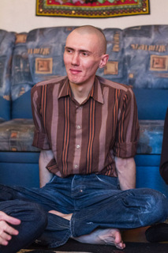

Привет! Меня зовут Алексей Сычев. Я программист, живу и работаю в Москве.

На сайте есть мое [резюме](cv/), которое осталось со времени моего поиска работы. В него я периодически добавляю профессиональные навыки.

Основное средство связи со мной — это электронная почта [alex@sychev.com](mailto:alex@sychev.com).

## На заметку
* [Список проектов, которые стоит поддержать](dont-forget-to-donate/)
* [Заметки о программировании](all-level-programming/)
